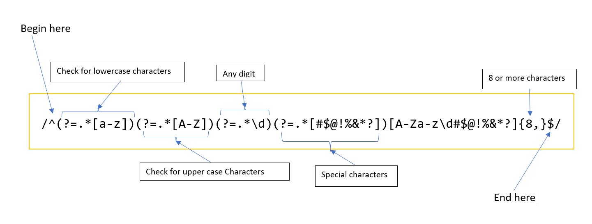

# Regex for Password validation.

## What is Regex?
Regex otherwise known as Regular expressions is a sequence of characterswhich specify a pattern. These patterns may be used to compare or find strings or a sequence of characters as well as in validation.

## Summary

Briefly summarize the regex you will be describing and what you will explain. Include a code snippet of the regex. Replace this text with your summary.
The conditions my Password should satisfy
*   Atleast 1 uppercase Alphabet
*   Atleast 1 number
*   Atleast 1 special character
*   Must contain 8 or more characters to satisfy 
  

## Table of Contents

- [Anchors](#anchors)
- [Quantifiers](#quantifiers)
- [OR Operator](#or-operator)
- [Character Classes](#character-classes)
- [Grouping and Capturing](#grouping-and-capturing)
- [Bracket Expressions](#bracket-expressions)
- [Greedy and Lazy Match](#greedy-and-lazy-match)
- [Boundaries](#boundaries)
- [Look-ahead and Look-behind](#look-ahead-and-look-behind)

## Regex Components 

### Anchors
* ^ Begining --> Matches the begining of the expression. Matches the position not a character in the expression.
* $ End --> Matches the end of the expression.  
### Quantifiers
Quantifiers are used to match the quantity or specify the  number of characters that the expression should have.  For example, 
`/^[a-z]{1,3}$/` -->
Matches any expression with 1 to 3 characters between a and z like 'air' 'abc' but doesnt match 'apple' since it contains 5 characters 
`/^(characters){8,}$/` In the above expression {8,} ensures that the password entered has a minimum length of 8 characters.  
### OR Operator
* | OR --> acts like a boolean OR operator.
  

### Character Classes
Character classes match a character from a specific character set like `\w` for letters or `\d` for digits.
  

### Grouping and Capturing

  

### Bracket Expressions

  

### Greedy and Lazy Match

  

### Boundaries

  

### Look-ahead
Positive Look-ahead matches an expression that matches the specifications
For example:  
`(?=.*[a-z])` --> matches the expression which begins and ends with a lower case letter.
  

## Author
View my Profile and projects
[here](https://github.com/CynthiaMohan)
